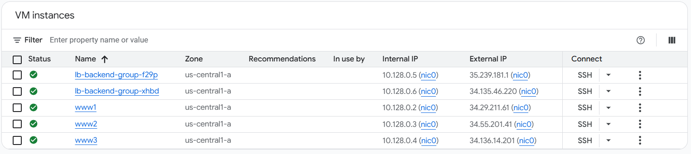
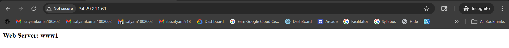
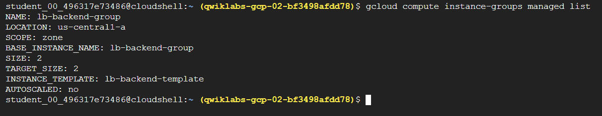
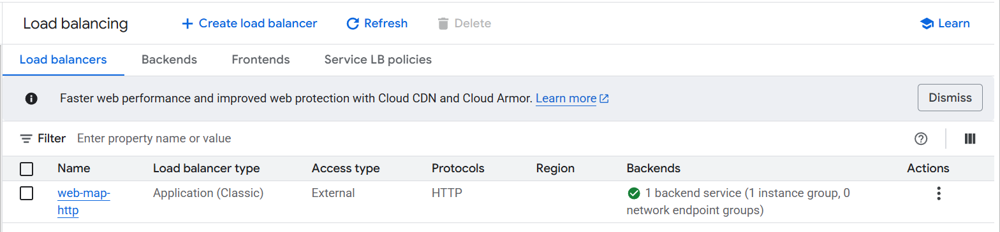
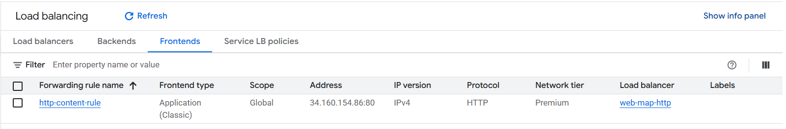
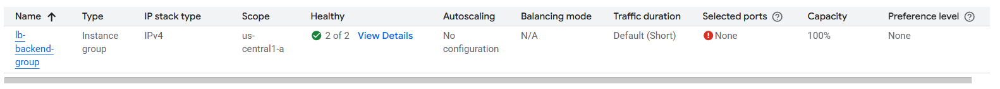
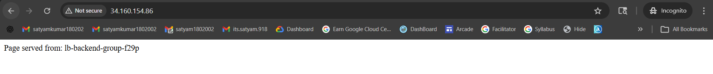
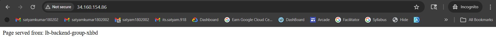
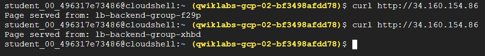

# 🌐 GCP Application Load Balancer Architecture

## 🚀 Overview

This project demonstrates how to design and deploy a **Layer 7 HTTP Load Balancer** on Google Cloud using Compute Engine and Managed Instance Groups.

The setup distributes incoming traffic across multiple backend instances to ensure high availability and reliability.

---

## 🧱 Architecture Components

* Google Cloud Compute Engine (VM Instances)
* Managed Instance Group (MIG)
* HTTP Load Balancer (Global)
* Health Checks
* Firewall Rules
* Apache Web Server

---

## 📁 Project Structure

```
gcp-application-load-balancer-architecture/
│
├── scripts/
├── outputs/
│   ├── screenshots/
│   └── curl-tests.txt
├── docs/
├── architecture/
└── README.md
```

---

## ⚙️ Setup Instructions

```bash
chmod +x scripts/*.sh

./scripts/setup-vpc.sh
./scripts/setup-firewall.sh
./scripts/setup-instances.sh
./scripts/setup-load-balancer.sh
```

---

## 🖥️ Infrastructure Proof

### 🔹 VM Instances Running



---

### 🔹 Apache Web Server Test



---

### 🔹 Managed Instance Group



---

### 🔹 Load Balancer Overview



---

### 🔹 Frontend IP Configuration



---

### 🔹 Backend Health Status



---

## 🌍 Load Balancer Output

### Request 1:



### Request 2:



---

## 🔁 Traffic Distribution Verification (CLI)



👉 Multiple curl requests confirm that traffic is distributed across different backend instances.

---

## 📄 Curl Test Output

```
See: outputs/curl-tests.txt
```

---

## 💡 Key Learnings

* How Layer 7 (HTTP) Load Balancer works in Google Cloud
* Importance of health checks in backend services
* Managed Instance Groups for scalability and availability
* Traffic distribution across multiple instances
* Basic cloud networking and firewall configuration

---

## ⚠️ Limitations

* HTTP only (no HTTPS/SSL)
* No autoscaling configured
* Manual infrastructure setup (no Terraform)

---

## 🔮 Future Improvements

* Add HTTPS with SSL certificates
* Implement autoscaling policies
* Convert setup to Infrastructure as Code (Terraform)
* Add monitoring & logging (Cloud Monitoring)

---

## 📌 Conclusion

This project demonstrates a complete end-to-end setup of a scalable and highly available web architecture using Google Cloud Load Balancing.

---
